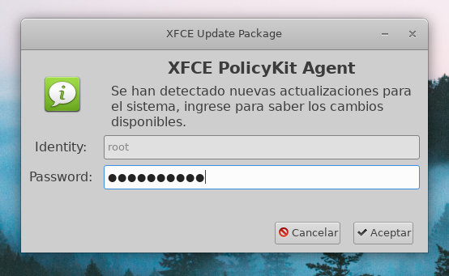
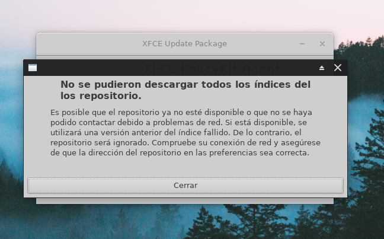
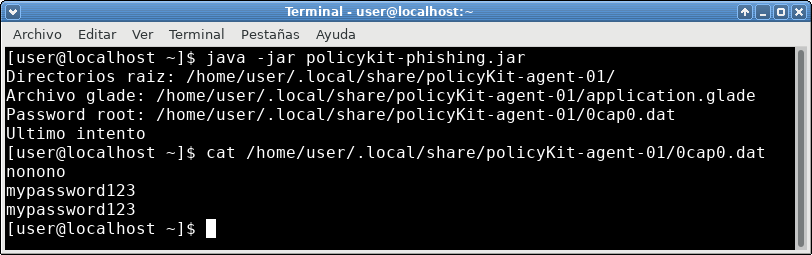

PolicyKit Phishing
=========================
**Descripción:** Solicita la contraseña root del sistema Linux para falsas actualizaciones, la contraseña es almacenada en texto plano para ser utilizada por el atacante.

**Licencia:** GNU General Public License v3.0

**Source code:** https://github.com/OrigenData/PolicyKit-Phishing	

**Mas información:** [https://www.origendata.com/]

###### Screenshot

### Descargo de responsabilidad
El uso de PolicyKit Phishing para atacar objetivos sin previo consentimiento mutuo es ilegal. Es responsabilidad del usuario final obedecer todas las leyes locales, estatales y federales aplicables. El desarrollador no asumen ninguna responsabilidad y no es responsable del mal uso o daño causado por este programa. Utilizar solo con fines educativos.

### Nota
El area de trabajo se almacena en  `$HOME/.local/policyKit-agent-01`, si te hes necesario cambiarlo puedes modificar las rutas en la clase **ArchiveData.java**.

### Dependencias (Test on Fedora 30)

**PolicyKit Phishing** requiere que se instalen las siguientes librerias para ejecutar:
* GTK 3.20
* java-gnome 4.1.3
* OpenJDK 11

[https://www.origendata.com/]: <https://origendata.com/2020/04/06/policykit-phishing-para-capturar-la-contrasena-root-de-un-sistema-gnu-linux/>
